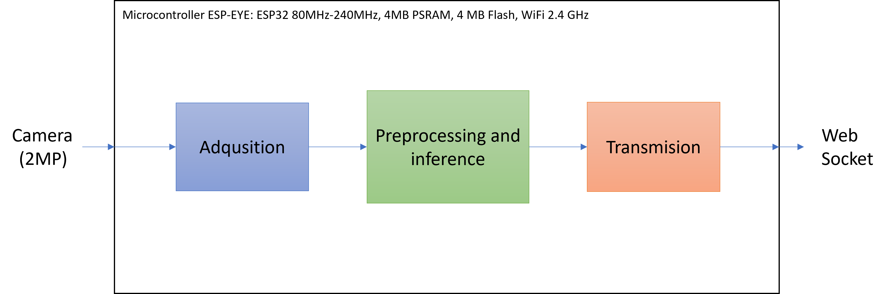
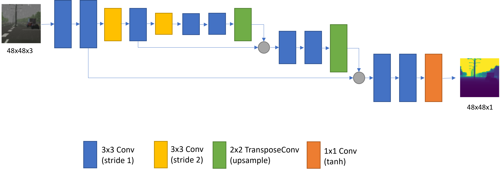
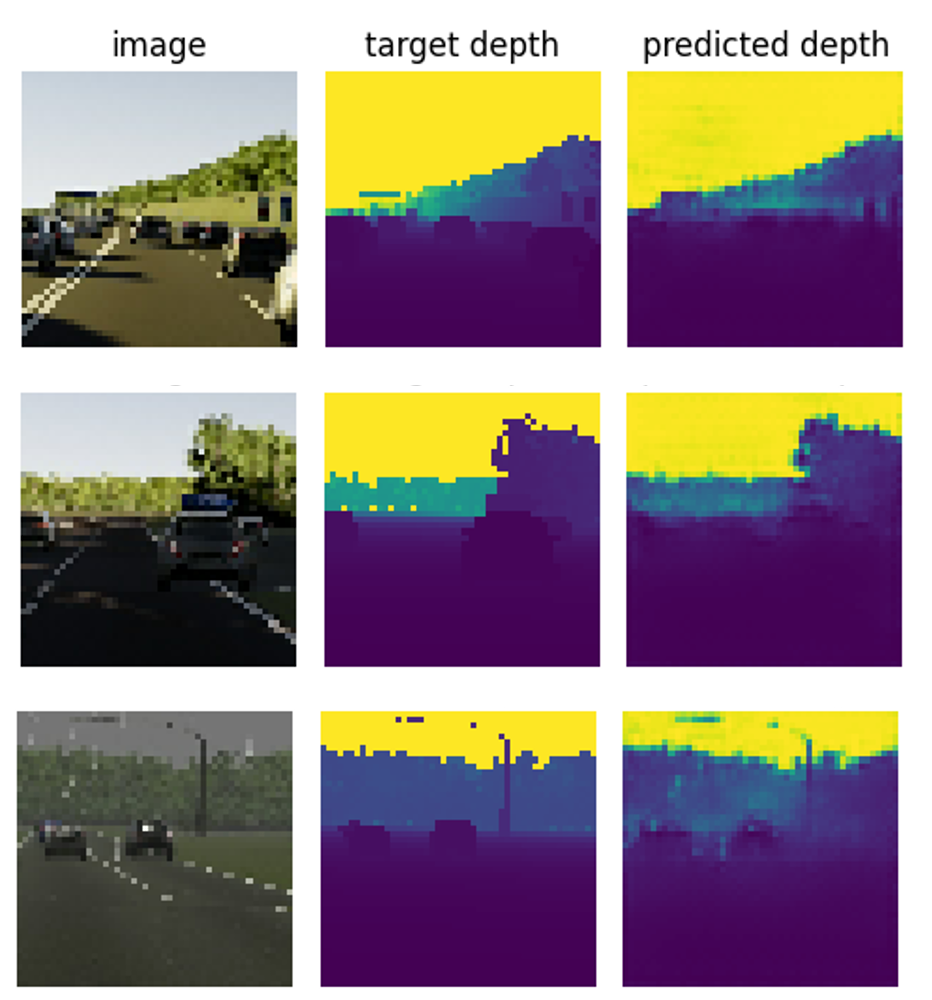

# Depth Map Estimation on Microcontrollers

## Introduction

In this project, we propose the implementation of an embedded system for depth map estimation in the field of autonomous driving. The system consists of a Microcontroller ESP-EYE with an integrated RGB camera and a Raspberry Pi 4 serving as a WebSocket host to receive and display pairs of RGB images captured along with their corresponding depth maps obtained by a lightweight deep-learning model running on the microcontroller. The implementation is done using the TensorFlow library [1]. For more detail, check [the project presentation](presentation.pptx).

*Figure 1: Block diagram*

[train.ipynb](train.ipynb) follows the training and quantization process of the depth map estimation model. [RaspberryWebSocket](RaspberryWebSocket) folder contains the html and python web socket codes from the raspberry side. [SocketCameraTF](SocketCameraTF) folder contains the converted to memory structure quantized model and the main code for the microcontroller side.

## Dataset

The Virtual KITTI 2 dataset [2], [3] is chosen because it is a more photorealistic version with improved features compared to the original KITTI dataset [4], [5], as it leverages recent enhancements of the Unity graphics engine [6].

This dataset consists of everyday driving scenes with different weather conditions at various times of the day. Each RGB image in the dataset includes its depth map, class segmentation map, instance segmentation map, optical flow map, and scene flow map.

In this project, only RGB images and depth maps are utilized.

## Pyramidal Feature Extraction Network

The neural network architecture is inspired by the lightweight pyramidal feature extraction network proposed by Peluso et al. [7] to preprocess RGB images on microcontrollers and predict its depth map. 

*Figure 2: Neural network for depth estimation*

## Results

*Figure 3: Inference results on the validation set. Images taken from VKITTI [2], [3] and stored on the microcontroller*

## References

[1] Martín Abadi, Ashish Agarwal, Paul Barham, Eugene Brevdo, Zhifeng Chen, Craig Citro, Greg S. Corrado, Andy Davis, Jeffrey Dean, Matthieu Devin, Sanjay Ghemawat, Ian Goodfellow, Andrew Harp, Geoffrey Irving, Michael Isard, Rafal Jozefowicz, Yangqing Jia, Lukasz Kaiser, Manjunath Kudlur, Josh Levenberg, Dan Mané, Mike Schuster, Rajat Monga, Sherry Moore, Derek Murray, Chris Olah, Jonathon Shlens, Benoit Steiner, Ilya Sutskever, Kunal Talwar, Paul Tucker, Vincent Vanhoucke, Vijay Vasudevan, Fernanda Viégas, Oriol Vinyals, Pete Warden, Martin Wattenberg, Martin Wicke, Yuan Yu, and Xiaoqiang Zheng. TensorFlow: Large-scale machine learning on heterogeneous systems, 2015. Software available from tensorflow.org.

[2] Y. Cabon, N. Murray, and M. Humenberger, “Virtual kitti 2,” 2020.

[3] A. Gaidon, Q. Wang, Y. Cabon, and E. Vig, “Virtual worlds as proxy for multi-object tracking analysis,” in Proceedings of the IEEE conference on Computer Vision and Pattern Recognition, 2016, pp. 4340–4349.

[4] A. Geiger, P. Lenz, C. Stiller, and R. Urtasun, “Vision meets robotics: The kitti dataset,” International Journal of Robotics Research (IJRR), 2013.

[5] M. Menze and A. Geiger, “Object scene flow for autonomous vehicles,” in Conference on Computer Vision and Pattern Recognition (CVPR), 2015.

[6] J. K. Haas, “A history of the unity game engine,” 2014.

[7] V. Peluso et al., "Monocular Depth Perception on Microcontrollers for Edge Applications," in IEEE Transactions on Circuits and Systems for Video Technology, vol. 32, no. 3, pp. 1524-1536, March 2022, doi: 10.1109/TCSVT.2021.3077395. Available: https://ieeexplore.ieee.org/document/9422776
